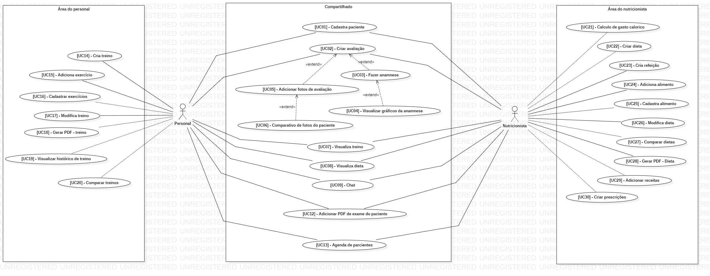
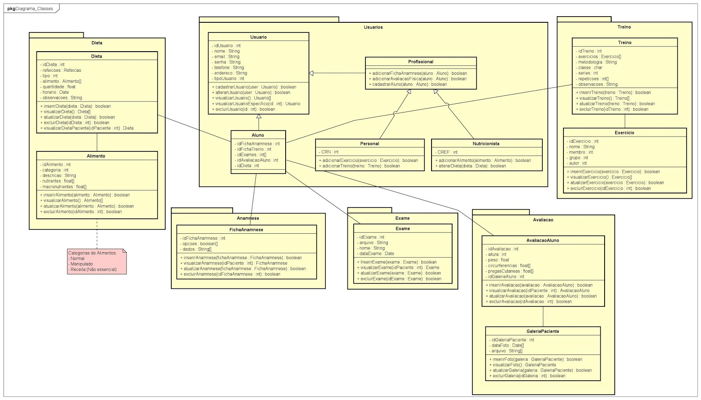
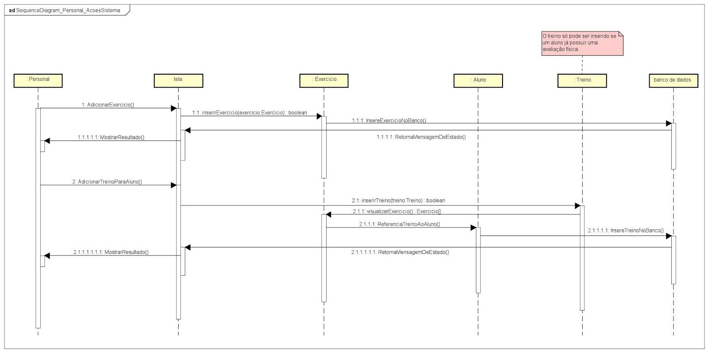
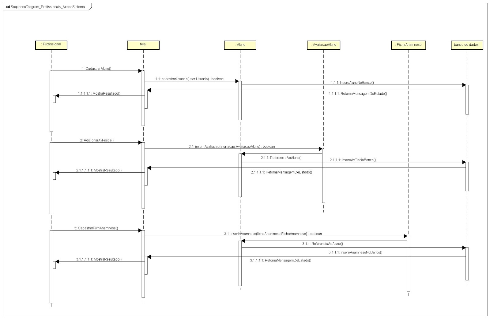
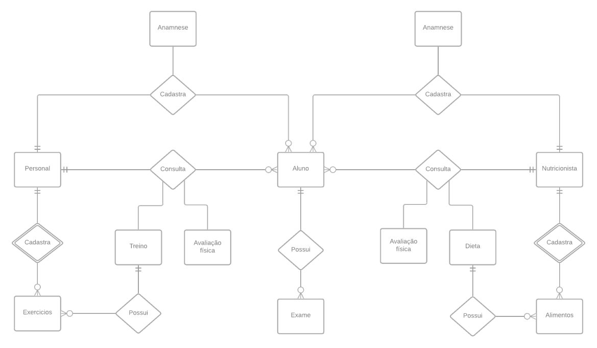
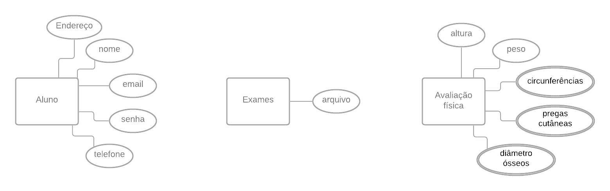
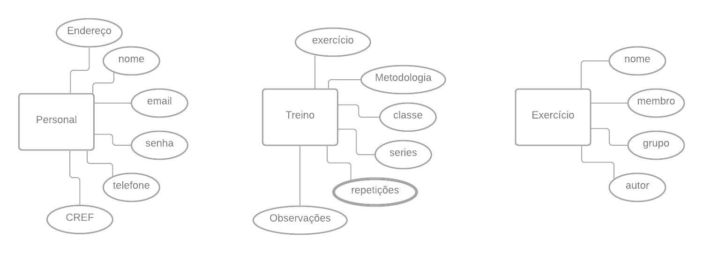

# Documentação do DROT

# Sumário de Documentação
<ol>
  <li>
    <a href="./Requisitos-Funcional/Requisitos-Funcionais.pdf">Documento de Requisitos Funcionais</a>
    <ul>
      <li>
        Este documentos reune os requisitos funcionais priorizados pelo Team BodyBuilder.
      </li>
    </ul>
  </li>
  <li>
    <a href="./Requisitos-Não-Funcional/Requisitos-Não-Funcional.pdf">Documento de Requisitos não Funcionais</a>
    <ul>
      <li>
        Este documentos reune os requisitos não funcionais priorizados pelo Team BodyBuilder.
      </li>
    </ul>
  </li>
  <li>
    <a href="./Projeto-UI">Documento do projeto UI</a>
    <ul>
      <li>
        Este documentos reune todas as telas do projeto priorizados pelo Team BodyBuilder.
      </li>
    </ul>
  </li>
  <li>
    <a href="./Relatorio-BodyBuilder/Relatorio-BodyBuilder.pdf">Relatorio BodyBuilder</a>
    <ul>
      <li>
        Este documentos reune o relatorio final do projeto priorizados pelo Team BodyBuilder.
      </li>
    </ul>
  </li>
  <li>
    <a href="./Diagrama-caso-uso/PersoFit.png">Diagrama de casos de uso</a>
    <ul>
      <li>
        A imagem a baixo reune os principais casos de uso que foram levantados pelo stackholders.
        
      </li>
    </ul>
  </li>
  <li>
    <a href="./Diagrama-classes/DiagramaDeClasses-Sistema.png">Diagrama de classe</a>
    <ul>
      <li>
        A imagem a baixo reune as classes do sistema que foram levantados pelas analises do diagrama de caso de uso.
        
      </li>
    </ul>
  </li>
  <li>
    <a href="./Diagrama-sequencia/">Diagrama de sequência</a>
    <ul>
      <li>
        Diagrama de Sequência de Personal com Exercício
        
      </li>
      <li>
        Diagrama de Sequência de Personal com Treino
        
      </li>
      <li>
        Diagrama de Sequência que compõe ações do Personal em Exercício e Treino.
        
      </li>
      <li>
        Diagrama de Sequência de Personal com Dieta
        
      </li>
      <li>
        Diagrama de Sequência com ações que profissionais exercem em um aluno
        
      </li>
      <li>
        Diagrama de Sequência que compõe ações do Personal em Exercício e Treino
        
      </li>
      <li>
        Diagrama de BD MER
        
      </li>
      <li>
       <li>
        Diagrama Relacional 
        
      </li>
        Diagrama Entidade Relacional Aluno
        
      </li>
      <li>
        Diagrama Entidade Relacional Personal
        
      </li>
      <li>
        Diagrama Entidade Relacional Nutricionista
        
      </li>
    </ul>
  </li>
<ol>

5. [Diagramação das Sequências](https://github.com/ericrodriguesfer/documentacao-drot/tree/master/Diagrama%20de%20Sequencia)
    * Esta sessão reune os principais diagramas de sequência priorizado pela equipe DROT.

6. [Diagrama Entitade Relacionamento](https://github.com/ericrodriguesfer/documentacao-drot/blob/master/Diagrama%20BD%20DER/Diagrama%20Entidade%20Relacionamento%20DROT.png)
    * Esta sessão reune o primeiro diagrama entitade relacionamento priorizado pela equipe DROT.

7. [Diagrama Entitade Relacionamento Refatorado](https://github.com/ericrodriguesfer/documentacao-drot/blob/master/Diagrama%20BD%20DER%20Release%201/release1_drot.png)
    * Esta sessão reune o primeiro diagrama entitade relacionamento refatorado priorizado pela equipe DROT.

8. [Modelo Entitade Relacionamento Refatorado](https://github.com/ericrodriguesfer/documentacao-drot/blob/master/Diagrama%20BD%20MER/Modelo%20Entidade%20Relacionamento%20DROT.png)
    * Esta sessão reune o primeiro modelo entitade relacionamento priorizado pela equipe DROT.

9. [Dicionário de Dados do BD](https://github.com/ericrodriguesfer/documentacao-drot/blob/master/Dicionario%20dados%20BD/Dicion%C3%A1rio%20de%20dados%20DROT.pdf)
    * Esta sessão reune o documento de dicionário de dados priorizado pela equipe DROT.

10. [Projeto de Interação do DROT](https://github.com/ericrodriguesfer/documentacao-drot/tree/master/Projeto%20de%20Intera%C3%A7%C3%A3o)
    * Esta sessão reune os documentos de projeto de interação priorizados pela equipe DROT.

11. [Projeto de UI do DROT](https://github.com/ericrodriguesfer/documentacao-drot/tree/master/Projeto%20de%20UI)
    * Esta sessão reune os documentos de projeto de UI priorizados pela equipe DROT.

12. [Documento Final do DROT](https://github.com/ericrodriguesfer/documentacao-drot/blob/master/Documento%20do%20Projeto/Relat%C3%B3rio%20de%20An%C3%A1lise%20do%20Dom%C3%ADnio%20-%20DROT.pdf)
    * Este documentos reune todo o resultado dos processos de Engenharia de Software aplicados no DROT.
